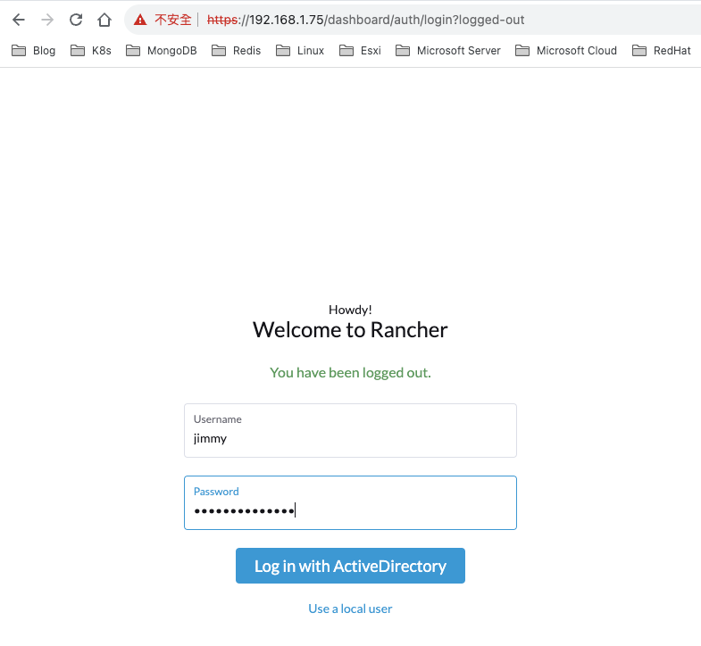

Rancher官網安裝網址：
https://ranchermanager.docs.rancher.com/zh/pages-for-subheaders/rancher-on-a-single-node-with-docker

最新版Rancher(v2.7.6)能夠納管的kubernetes版本為1.26.4：
https://www.suse.com/suse-rancher/support-matrix/all-supported-versions/rancher-v2-7-6/


## 一、Rancher Server安裝

### 一、使用docker起容器
```bash
root@k8s-node75u:~# sudo docker run --privileged -d --restart=unless-stopped -p 80:80 -p 443:443 rancher/rancher

root@k8s-node75u:~# docker ps
CONTAINER ID   IMAGE                       COMMAND                  CREATED          STATUS              PORTS                                                                      NAMES
0e92a3ece9cd   rancher/rancher             "entrypoint.sh"          4 minutes ago    Up About a minute   0.0.0.0:80->80/tcp, :::80->80/tcp, 0.0.0.0:443->443/tcp, :::443->443/tcp   dreamy_rubin
```


### 二、查看初始密碼


```bash
root@k8s-node75u:~# docker logs  0e92a3ece9cd  2>&1 | grep "Bootstrap Password:"
2023/09/20 09:50:01 [INFO] Bootstrap Password: 79j4khgd9952rmn55kdntxt7kwxfn7f7dvpmrsgx6nr7wqblrtpp6l
```

### 三、登入

### 四、重新設定admin密碼

登入成功頁面


## 二、匯入現有集群

### 一、點選Import Existing


### 二、點選Import any Kubernetes cluster(Generic)

### 三、填寫Cluster Name(自己決定，以利後續辨識)，點選Create


### 四、創建之後，會有提供加入的方式，選擇第二項


```bash
# master節點執行
root@k8s-master71u:~# curl --insecure -sfL https://192.168.1.75/v3/import/ff4mlx8k768hsz8vmwl89lqhbmcsfbttkxqdtmk4m8pgqsrnd87pqc_c-m-gq2vbtfn.yaml | kubectl apply -f -

# 查看pod是否都創建成功
root@k8s-master71u:~# kubectl get pod -n cattle-system -o wide
NAME                                    READY   STATUS    RESTARTS   AGE   IP               NODE          NOMINATED NODE   READINESS GATES
cattle-cluster-agent-6c97c478bb-mjgwg   1/1     Running   0          5m    10.244.14.137    k8s-node75u   <none>           <none>
cattle-cluster-agent-6c97c478bb-vdn59   1/1     Running   0          16m   10.244.255.199   k8s-node76u   <none>           <none>
rancher-webhook-74c9bd4d6-znrdp         1/1     Running   0          61s   10.244.255.201   k8s-node76u   <none>           <none>

```


### 五、確認現有集群已加入納管
加入rancher需要一點時間，請耐心等候，如果鏡像拉取失敗，可以手動去下載鏡像


### 六、開啟Kubectl Shell介面，Rancher會臨時起一個容器來跑Shell指令，關閉Shell介面，容器就會刪除


```bash
root@k8s-master71u:~# kubectl get pod -n cattle-system -o wide
NAME                                    READY   STATUS    RESTARTS   AGE     IP               NODE          NOMINATED NODE   READINESS GATES
cattle-cluster-agent-6c97c478bb-mjgwg   1/1     Running   0          6m11s   10.244.14.137    k8s-node75u   <none>           <none>
cattle-cluster-agent-6c97c478bb-vdn59   1/1     Running   0          17m     10.244.255.199   k8s-node76u   <none>           <none>
dashboard-shell-75g77                   2/2     Running   0          9s      10.244.255.202   k8s-node76u   <none>           <none>
rancher-webhook-74c9bd4d6-znrdp         1/1     Running   0          2m12s   10.244.255.201   k8s-node76u   <none>           <none>
```


## 三、加入Windows Server Active Directory (LDAP)

Rancher官網設定網址： https://ranchermanager.docs.rancher.com/zh/how-to-guides/new-user-guides/authentication-permissions-and-global-configuration/authentication-config/configure-active-directory

### 一、查看可以整合登入驗證的方式


### 二、創建AD使用者，供Rancher獲取ldap使用者資料


### 三、使用ldapsearch測試一下，是否可以查找到剛剛建立的使用者資訊
```bash
chenqingze@chenqingze-MBP ~ % ldapsearch -x -H "ldap://192.168.1.49:389" -D "jimmyhome\rancheruser" -w "密碼" \
 -b "dc=jimmyhome,dc=tw" -s sub "sAMAccountName=rancheruser"
# extended LDIF
#
# LDAPv3
# base <dc=jimmyhome,dc=tw> with scope subtree
# filter: sAMAccountName=rancheruser
# requesting: ALL
#

# rancheruser, Users, jimmyhome.tw
dn: CN=rancheruser,CN=Users,DC=jimmyhome,DC=tw
objectClass: top
objectClass: person
objectClass: organizationalPerson
objectClass: user
cn: rancheruser
givenName: rancheruser
distinguishedName: CN=rancheruser,CN=Users,DC=jimmyhome,DC=tw
instanceType: 4
whenCreated: 20230920115311.0Z
whenChanged: 20230920120448.0Z
displayName: rancheruser
uSNCreated: 16399
uSNChanged: 16452
name: rancheruser
objectGUID:: B9nTPDTyY0ehHZz4mWIJ1Q==
userAccountControl: 66048
badPwdCount: 0
codePage: 0
countryCode: 0
badPasswordTime: 0
lastLogoff: 0
lastLogon: 0
pwdLastSet: 133396843913520620
primaryGroupID: 513
objectSid:: AQUAAAAAAAUVAAAA2KPkIYA62ax0WlhyTwQAAA==
accountExpires: 9223372036854775807
logonCount: 0
sAMAccountName: rancheruser
sAMAccountType: 805306368
userPrincipalName: rancheruser@jimmyhome.tw
objectCategory: CN=Person,CN=Schema,CN=Configuration,DC=jimmyhome,DC=tw
dSCorePropagationData: 16010101000000.0Z
lastLogonTimestamp: 133396850882972826

# search reference
ref: ldap://ForestDnsZones.jimmyhome.tw/DC=ForestDnsZones,DC=jimmyhome,DC=tw

# search reference
ref: ldap://DomainDnsZones.jimmyhome.tw/DC=DomainDnsZones,DC=jimmyhome,DC=tw

# search reference
ref: ldap://jimmyhome.tw/CN=Configuration,DC=jimmyhome,DC=tw

# search result
search: 2
result: 0 Success

# numResponses: 5
# numEntries: 1
# numReferences: 3

```

### 四、整合AD驗證


確認驗證成功，連接到ldap


可以看到，此時已經自動改成用剛剛驗證的ad帳戶登入了


### 五、再到AD創建一個使用者，驗證一下，是否Rancher可以獲取到此使用者帳號


編輯default project(裡面只有一個default namespace)


添加ldap帳號


可以看到有jimmy帳號


添加此帳號


登出Rancher，改用jimmy帳號登入，密碼是ad中設定的密碼

確認可以登入


可以看到，能查看到default project與default namespace


dashboard shell也是可以使用的，但只能看到default namespace的資源


是無法查看kube-system namespace的資源，確實跟前面設定的權限是符合的


### 六、也可以下載連線設定檔到自己常用linux主機，連線管理


```bash
# 1. 將下載的設定檔，scp到常用linux主機
chenqingze@chenqingze-MBP ~ % scp /Users/chenqingze/Downloads/kubernetes-config.yml root@192.168.1.76:/root/

# 2. 可以看到設定檔
root@k8s-node76u:~# ls -l
total 9376
-rw-r--r-- 1 root root    1396 Sep 20 12:47 kubernetes-config.yml

# 3. 在使用者家目錄下，創建.kube目錄
root@k8s-node76u:~# mkdir .kube

# 4. 將設定檔複製到.kube目錄，且命名為config(因kubectl預設就是用.kube/config設定檔連線)
root@k8s-node76u:~# cp kubernetes-config.yml ~/.kube/config

# 5. 確認可以連線，查看default namespace下的資源
root@k8s-node76u:~# kubectl get pod
NAME         READY   STATUS    RESTARTS        AGE
test-nginx   1/1     Running   1 (3h20m ago)   7h26m

# 6. 其他namespace下的資源，是無法查看的
root@k8s-node76u:~# kubectl get pod -n kube-system
Error from server (Forbidden): pods is forbidden: User "u-hx7xy6ap22" cannot list resource "pods" in API group "" in the namespace "kube-system"
```