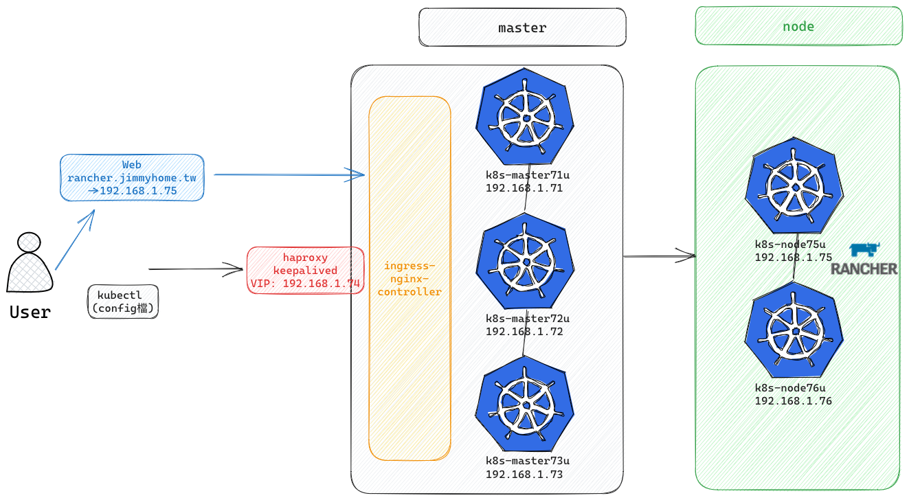
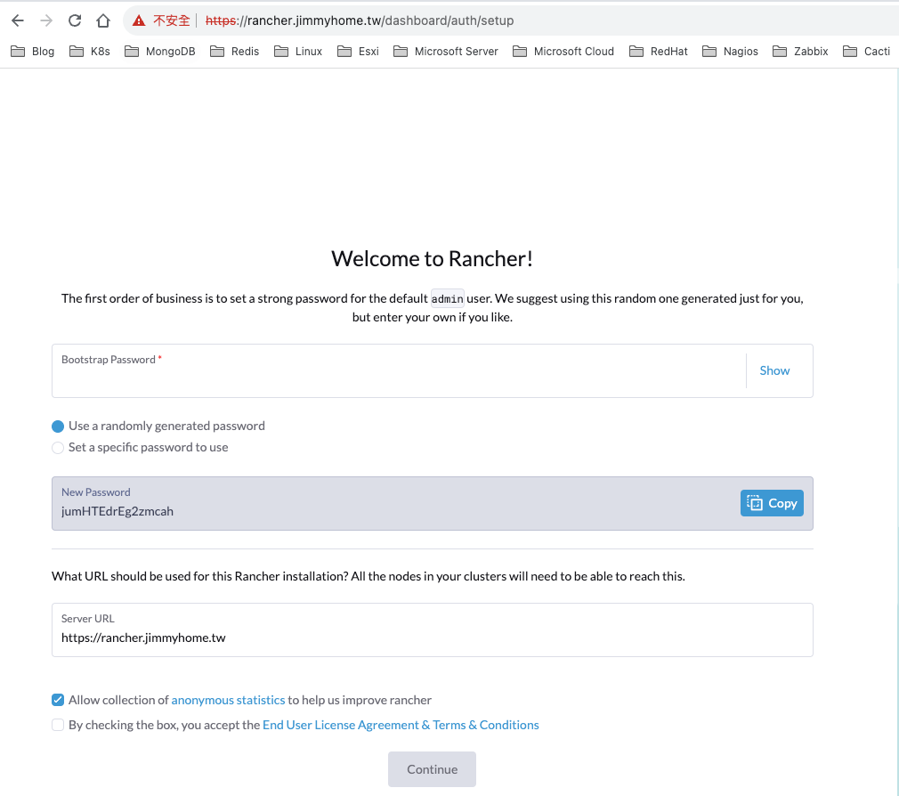
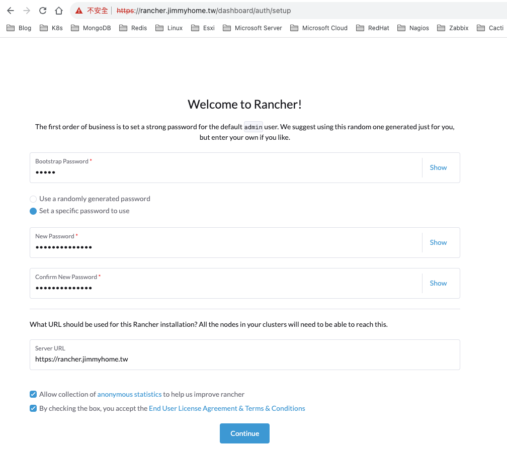
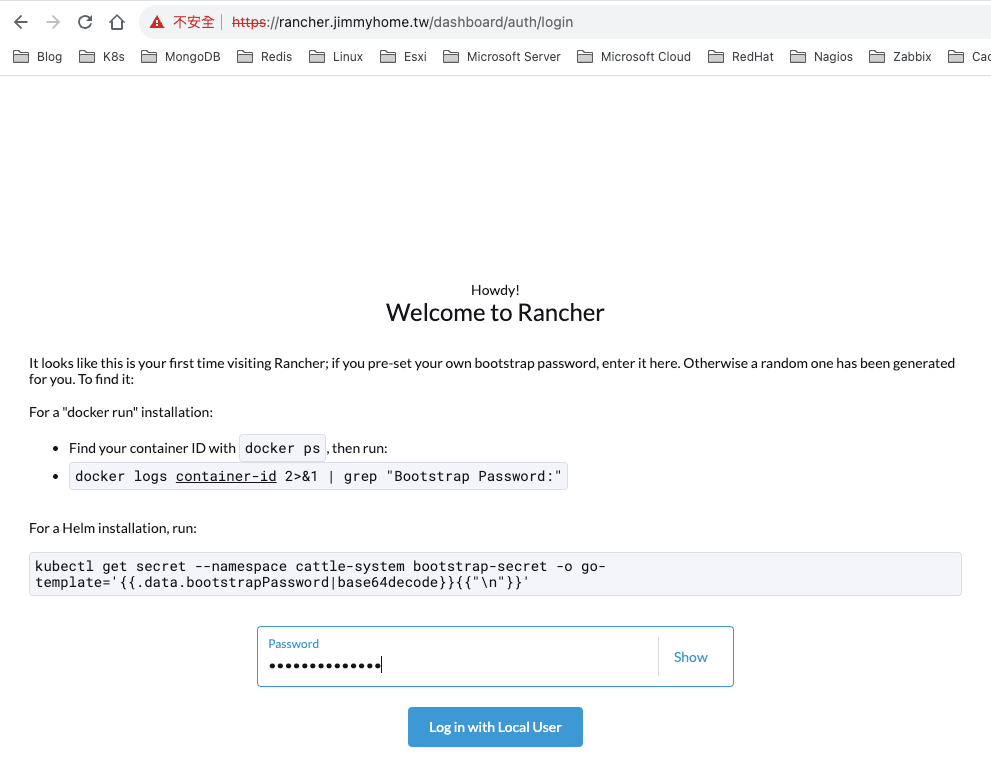
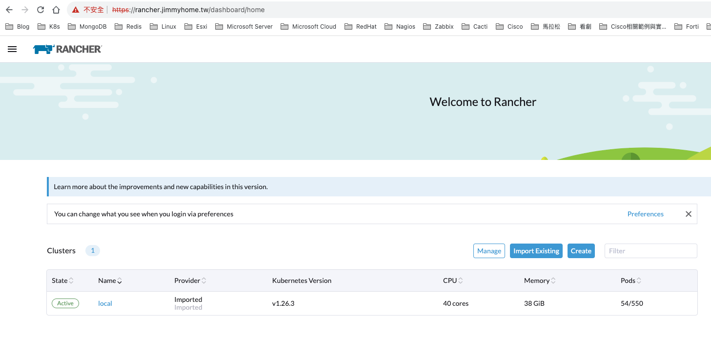
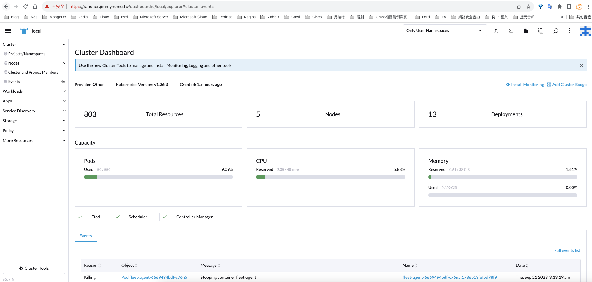
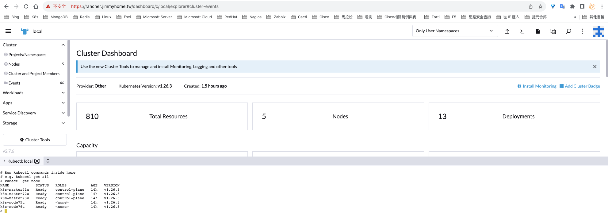

安裝先決條件：
- kubernetes 集群
- Ingress Controller
- Helm 、kubectl CLI 工具

## 一、Ingress Controller安裝

github網址:

[https://github.com/kubernetes/ingress-nginx](https://github.com/kubernetes/ingress-nginx)

```bash
chenqingze@chenqingze-MBP ~ % scp /Users/chenqingze/Downloads/ingress-nginx-controller-v1.6.4.tar.gz root@192.168.1.71:/root
/

root@k8s-master71u:~# tar -xzvf ingress-nginx-controller-v1.6.4.tar.gz

root@k8s-master71u:~# cd ingress-nginx-controller-v1.6.4/deploy/static/provider/baremetal


# Deployment改成DaemonSet 
# 添加hostNetwork: true
root@k8s-master71u:~/ingress-nginx-controller-v1.6.4/deploy/static/provider/baremetal# vim deploy.yaml
---
apiVersion: apps/v1
kind: DaemonSet
metadata:
  labels:
    app.kubernetes.io/component: controller
    app.kubernetes.io/instance: ingress-nginx
    app.kubernetes.io/name: ingress-nginx
    app.kubernetes.io/part-of: ingress-nginx
    app.kubernetes.io/version: 1.6.4
  name: ingress-nginx-controller
  namespace: ingress-nginx
spec:
  minReadySeconds: 0
  revisionHistoryLimit: 10
  selector:
    matchLabels:
      app.kubernetes.io/component: controller
      app.kubernetes.io/instance: ingress-nginx
      app.kubernetes.io/name: ingress-nginx
  template:
    metadata:
      labels:
        app.kubernetes.io/component: controller
        app.kubernetes.io/instance: ingress-nginx
        app.kubernetes.io/name: ingress-nginx
    spec:
      hostNetwork: true
      containers:

root@k8s-master71u:~/ingress-nginx-controller-v1.6.4/deploy/static/provider/baremetal# kubectl apply -f deploy.yaml


root@k8s-master71u:~/ingress-nginx-controller-v1.6.4/deploy/static/provider/baremetal# kubectl get pod -n ingress-nginx -owide
NAME                                   READY   STATUS      RESTARTS   AGE   IP               NODE          NOMINATED NODE   READINESS GATES
ingress-nginx-admission-create-zmkrl   0/1     Completed   0          73s   10.244.255.199   k8s-node76u   <none>           <none>
ingress-nginx-admission-patch-rlglf    0/1     Completed   0          73s   10.244.14.133    k8s-node75u   <none>           <none>
ingress-nginx-controller-js2fl         1/1     Running     0          73s   192.168.1.76     k8s-node76u   <none>           <none>
ingress-nginx-controller-mmc2h         1/1     Running     0          73s   192.168.1.75     k8s-node75u   <none>           <none>
```

## 二、Kubectl與Helm CLI 工具安裝

官方安裝網站： https://helm.sh/docs/intro/install/

Helm v3.12.3 Binary Releases：
https://get.helm.sh/helm-v3.12.3-linux-amd64.tar.gz

```bash
root@k8s-master71u:~# wget https://get.helm.sh/helm-v3.12.3-linux-amd64.tar.gz

root@k8s-master71u:~# tar -zxvf helm-v3.12.3-linux-amd64.tar.gz

root@k8s-master71u:~# mv linux-amd64/helm /usr/local/bin/helm
```


Kubectl：
[https://kubernetes.io/docs/setup/production-environment/tools/kubeadm/install-kubeadm/](https://kubernetes.io/docs/setup/production-environment/tools/kubeadm/install-kubeadm/)

如果主機就是master,應該都有kubectl了,此流程可以略過

```bash
# 1. Update the apt package index and install packages needed to use the Kubernetes apt repository:
sudo apt-get update
sudo apt-get install -y apt-transport-https ca-certificates curl

# 2. Download the Google Cloud public signing key:
curl -fsSL https://packages.cloud.google.com/apt/doc/apt-key.gpg | sudo gpg --dearmor -o /etc/apt/keyrings/kubernetes-archive-keyring.gpg

# 3. Add the Kubernetes apt repository:
echo "deb [signed-by=/etc/apt/keyrings/kubernetes-archive-keyring.gpg] https://apt.kubernetes.io/ kubernetes-xenial main" | sudo tee /etc/apt/sources.list.d/kubernetes.list

# 4. 檢查是否已經添加源 
root@k8s-master71u:~# cat /etc/apt/sources.list.d/kubernetes.list
deb [signed-by=/etc/apt/keyrings/kubernetes-archive-keyring.gpg] https://apt.kubernetes.io/ kubernetes-xenial main

# 5. Update apt package index, install kubelet, kubeadm and kubectl, and pin their version:
sudo apt-get update
```

```bash
root@k8s-master71u:~# sudo apt-get install -y kubectl=1.26.3-00

# 查看版本
root@k8s-master71u:~# kubectl version
```


## 三、Rancher高可用管理平台安裝

### 一、添加 Helm Chart 倉庫

```bash
root@k8s-master71u:~# helm repo add rancher-stable https://releases.rancher.com/server-charts/stable

"rancher-stable" has been added to your repositories
```

### 二、為 Rancher 建立命名空間


```bash
root@k8s-master71u:~# kubectl create namespace cattle-system
```

### 三、選擇 SSL 配置

Rancher 產生的憑證（預設）	
需要 cert-manager

### 四、安裝 cert-manager

```bash

# 如果你手動安裝了CRD，而不是在 Helm 安裝命令中添加了 '--set installCRDs=true' 選項，你應該在升級 Helm Chart 之前升級 CRD 資源。
root@k8s-master71u:~# kubectl apply -f https://github.com/cert-manager/cert-manager/releases/download/v1.11.0/cert-manager.crds.yaml

# 添加 Jetstack Helm 倉庫
root@k8s-master71u:~# helm repo add jetstack https://charts.jetstack.io

# 更新本地 Helm Chart 倉庫緩存
root@k8s-master71u:~# helm repo update
Hang tight while we grab the latest from your chart repositories...
...Successfully got an update from the "jetstack" chart repository
...Successfully got an update from the "rancher-stable" chart repository
Update Complete. ⎈Happy Helming!⎈

# 安裝 cert-manager Helm Chart
root@k8s-master71u:~# helm install cert-manager jetstack/cert-manager \
  --namespace cert-manager \
  --create-namespace \
  --version v1.11.0

# 安裝完 cert-manager 后，你可以通過檢查 cert-manager 命名空間中正在運行的 Pod 來驗證它是否已正確部署
root@k8s-master71u:~# kubectl get pods --namespace cert-manager
NAME                                       READY   STATUS      RESTARTS   AGE
cert-manager-64f9f45d6f-8j65z              1/1     Running     0          2m1s
cert-manager-cainjector-56bbdd5c47-4hngr   1/1     Running     0          2m1s
cert-manager-startupapicheck-vzq7z         0/1     Completed   0          2m
cert-manager-webhook-d4f4545d7-rhbkv       1/1     Running     0          2m1s
```

### 五、根據你選擇的證書選項，通過 Helm 安裝 Rancher

採Rancher 生成的證書方式

Rancher Helm Chart 選項：
https://ranchermanager.docs.rancher.com/zh/getting-started/installation-and-upgrade/installation-references/helm-chart-options

<font color=red>需多指定ingressClassName為nginx</font>


```bash
root@k8s-master71u:~# helm install rancher rancher-stable/rancher \
  --namespace cattle-system \
  --set hostname=rancher.jimmyhome.tw \
  --set bootstrapPassword=admin \
  --set ingress.ingressClassName=nginx


NAME: rancher
LAST DEPLOYED: Wed Sep 20 18:31:10 2023
NAMESPACE: cattle-system
STATUS: deployed
REVISION: 1
TEST SUITE: None
NOTES:
Rancher Server has been installed.

NOTE: Rancher may take several minutes to fully initialize. Please standby while Certificates are being issued, Containers are started and the Ingress rule comes up.

Check out our docs at https://rancher.com/docs/

If you provided your own bootstrap password during installation, browse to https://rancher.jimmyhome.tw to get started.

If this is the first time you installed Rancher, get started by running this command and clicking the URL it generates:


echo https://rancher.jimmyhome.tw/dashboard/?setup=$(kubectl get secret --namespace cattle-system bootstrap-secret -o go-template='{{.data.bootstrapPassword|base64decode}}')


To get just the bootstrap password on its own, run:


kubectl get secret --namespace cattle-system bootstrap-secret -o go-template='{{.data.bootstrapPassword|base64decode}}{{ "\n" }}'


Happy Containering!
```


```bash
# 等待 Rancher 運行
root@k8s-master71u:~# kubectl -n cattle-system rollout status deploy/rancher
Waiting for deployment "rancher" rollout to finish: 0 of 3 updated replicas are available...
Waiting for deployment "rancher" rollout to finish: 1 of 3 updated replicas are available...
Waiting for deployment "rancher" rollout to finish: 2 of 3 updated replicas are available...
deployment "rancher" successfully rolled out

```

### 六、驗證 Rancher Server 是否部署成功

```bash
root@k8s-master71u:~# kubectl -n cattle-system get deploy
NAME      READY   UP-TO-DATE   AVAILABLE   AGE
rancher   3/3     3            3           53s

root@k8s-master71u:~# kubectl -n cattle-system get ingress
NAME      CLASS   HOSTS                  ADDRESS                     PORTS     AGE
rancher   nginx   rancher.jimmyhome.tw   192.168.1.75,192.168.1.76   80, 443   67s
```


```bash
# 我自己的筆電，先設定/etc/hosts測試網頁訪問
# 如是內部有dns server的，就到dns server設定a record解析
chenqingze@chenqingze-MBP ~ % sudo vim /etc/hosts

192.168.1.75 rancher.jimmyhome.tw
```

打 https://rancher.jimmyhome.tw 可以看到網頁

由上方helm install rancher完成時，可以看到以下兩個指令，可以獲取到預設admin帳號的密碼
```bash
# If this is the first time you installed Rancher, get started by running this command and clicking the URL it generates
root@k8s-master71u:~# echo https://rancher.jimmyhome.tw/dashboard/?setup=$(kubectl get secret --namespace cattle-system bootstrap-secret -o go-template='{{.data.bootstrapPassword|base64decode}}')
https://rancher.jimmyhome.tw/dashboard/?setup=admin


# To get just the bootstrap password on its own, run
root@k8s-master71u:~# kubectl get secret --namespace cattle-system bootstrap-secret -o go-template='{{.data.bootstrapPassword|base64decode}}{{ "\n" }}'
admin
```

重設admin帳號的密碼


輸入剛剛重設的admin密碼，登入


可以看到集群資訊，state為Active


進入集群，可以看到集群詳細訊息


也可以使用dashboard shell去管理集群

