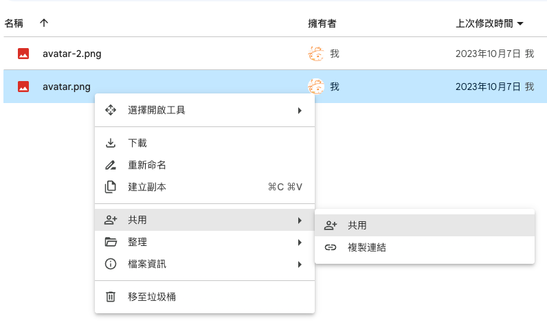
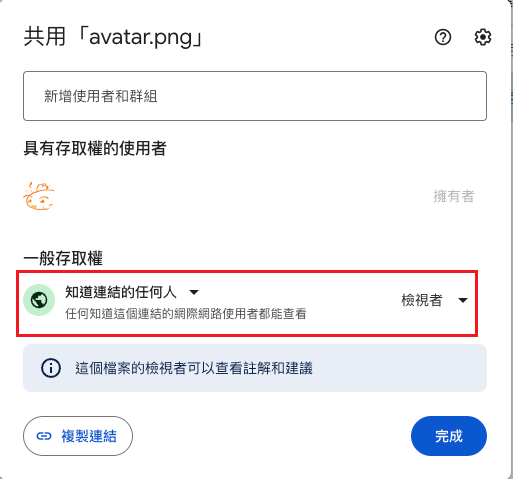

簡單來說，將圖片存在google drive，設定共享，複製連結，將連結修改即可。





點複製連結
```
# 連結如下
https://drive.google.com/file/d/1Gdh2dKRP1X4xv8Br6K56SZdn_RwgTOj1/view?usp=sharing

```
修改連結

```
# 1. 只要提取上述連結中的字串
....../file/d/字串/view?......

字串 = 1Gdh2dKRP1X4xv8Br6K56SZdn_RwgTOj1

# 2. 將字串與以下連結合併

https://drive.google.com/uc?export=view&id=字串

完整連結 = https://drive.google.com/uc?export=view&id=1Gdh2dKRP1X4xv8Br6K56SZdn_RwgTOj1

# 3. 此完整連結就能永久分享在各處，例如以下markdown插入圖片分享


```

插入圖片效果


