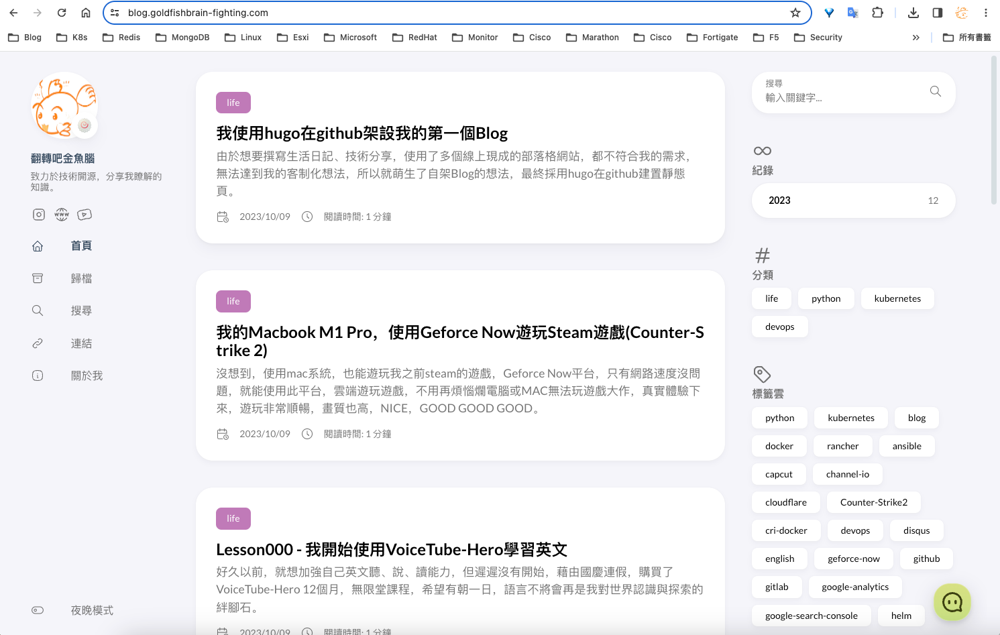

先稍微記錄一下，整體建置與工作流程：

1. hugo官網找喜歡的theme(https://themes.gohugo.io/)
2. 選擇使用Stack(https://themes.gohugo.io/themes/hugo-theme-stack/)
3. 作者github裡面有教學，可以直接clone代碼匯入我的github repositiry
	1. 新repositiry名稱使用：github帳號id.github.io
4. git clone代碼到本機，hugo server執行看看，打上http://localhost:1313，就能直接看到頁面效果
5. 修改手機版無法看到大綱toc問題(直接複製貼上裡面四個檔案到相對的目錄中)
	1. 參考網站(https://github.com/CaiJimmy/hugo-theme-stack/pull/615/files#diff-eef437e68bc6669e72d9b52c51e6f18c33aaedc919cd231abc1a68aa7030fcb3)
6. 網站左邊menu 透明漂亮icon使用，svg檔製作
	1. 參考網站(https://tablericons.com/)
7. 網站左邊page新增與修改
8. 色碼表，網站各處顏色更改會用到
	1. 參考網站(https://www.ifreesite.com/color/)
9. 開始優化美化頁面
	1. 參考網站(https://blog.linsnow.cn/p/modify-hugo/)
	2. 參考網站(https://ponder.lol/2023/custom-hugo-theme-stack/)
10. 添加網站底部顯示發表xx文章、本站運行xx天、本站總訪問量xx次功能
	1. 參考網站(https://thirdshire.com/post/hugo-stack-renovation/)
11. 修改文章description描述字體大小，縮小(在article.scss裡面的.article-subtitle)
12. 添加disqus評論功能
	1. 參考網站(https://blog.tershi.com/pages/cafd93/#%E8%A8%BB%E5%86%8A-disqus-%E5%B8%B3%E8%99%9F)
13. 添加channel.io頁面即時聊天功能
	1. 參考網站(https://thirdshire.com/post/hugo-stack-renovation/)
14. 以上在本地修改與美化頁面功能驗證完畢後，將代碼推送到github中
15. 使用github workflow建立自動發佈gh-pages branch功能
	1. 參考網站(https://www.zoeydc.com/zh/posts/2021-05-23-hugo-website_github-pages_custom-domain/)
16. 網頁測試打(https://github帳號id.github.io)，網站是否呈現
17. 購買domain name，我使用cloudflare(https://dash.cloudflare.com/)
	1. 購買domain name
	2. 更新DNS記錄，設定CNAME，名稱blog，內容github預設pages頁面網址(github帳號id.github.io)
	3. 啟用http強制轉到https
18. 將github pages自訂網域名
	1. 至github專案中，Settings->Pages->Branch選擇gh-pages分支
	2. Custom domain->設定已註冊的domain name(blog.goldfishbrain-fighting.com)
19. 網頁測試打domain name，網站是否呈現(https://blog.goldfishbrain-fighting.com/)
20. google-search-console添加
	1. 會需要驗證網站擁有權，將google提供檔案放置網站根目錄下(static/googlexxxxxx.html)
	2. 添加sitemap，好讓google幫我們產生索引，後續才能夠過google瀏覽器，搜尋到我的網站(可能會需要好多天，才能完成)
21. google-analytics添加
	1. 好讓後續可以分析網站使用狀況
22. 以上就完成了使用hugo在github架站
23. 後續新文章撰寫，我是使用obsidian撰寫文章
24. 使用template功能，寫文章時，快速插入front matter
25. 如果categories有新增，記得要先去categories目錄新增出來
26. 如有快速貼上圖片，圖片記得改檔名，因為會有空格，網站會無法正常辨識路徑和檔名
27. 撰寫文章完畢，使用obsidian git插件，直接使用快捷鍵ctrl+p叫出命令面板，執行Commit all changes、Push就能將文章推送到我的github中
28. github接收到commit，就會自動使用workflow幫我佈屬gh-pages
29. 以下就是網站呈現的樣子

