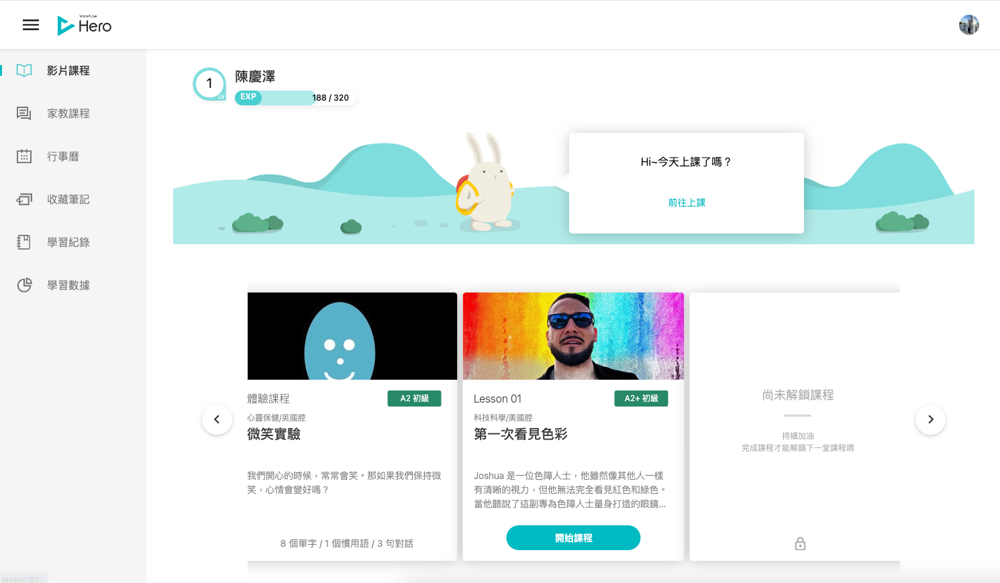

紀錄一下，為什麼要購買此課程，很久以前，就有這樣的目標，想要將英文這門語言學好，
礙於工作轉職、人生待辦事項優先順序，所以一直遲遲沒有開始。

近期是在學習程式語言python與django，想要將工作更有效率的完成(辦公自動化)與管理平台化(網頁點一點完成需求)，陸陸續續學習了快一年了，開始覺得不是我的興趣，也常常會提不起勁繼續學習，或許是沒有能大量應用上的環境，變的學習時感覺很孤單、很無趣，也跟著導致我連生活也提不起勁，因為會覺得，有很多資料要看、要練習，但是要看、要練習時，就又會覺得提不起勁，就在這樣的心態上拉扯，也就因為這樣，導致生活和精神也越來越疲憊。

因為上述的狀況，讓我心態有所轉變，人生還那麼長，還有很多事情等著我去探險與嘗試，於是就將人生待辦事項優先順序調整了，從影片去學習語言，讓學習不再那麼枯燥乏味，又能藉由影片瞭解更多新知與世界上發生了什麼事，同時也能讓我藉由這門語言，未來能與世界各地更拉近一點距離。

我是直接購買12個月，一個月675台幣，無限堂學習，不強求變的多厲害，考什麼多益、雅思，只希望能在未來(1年之後)，遇到外國人，能與之簡單對談(不會害怕)，聽到電影影集，能夠聽懂在說什麼，最後給自己加油打氣，加油我一定行，堅持下去。

現在夜深了，其實也該睡了。

