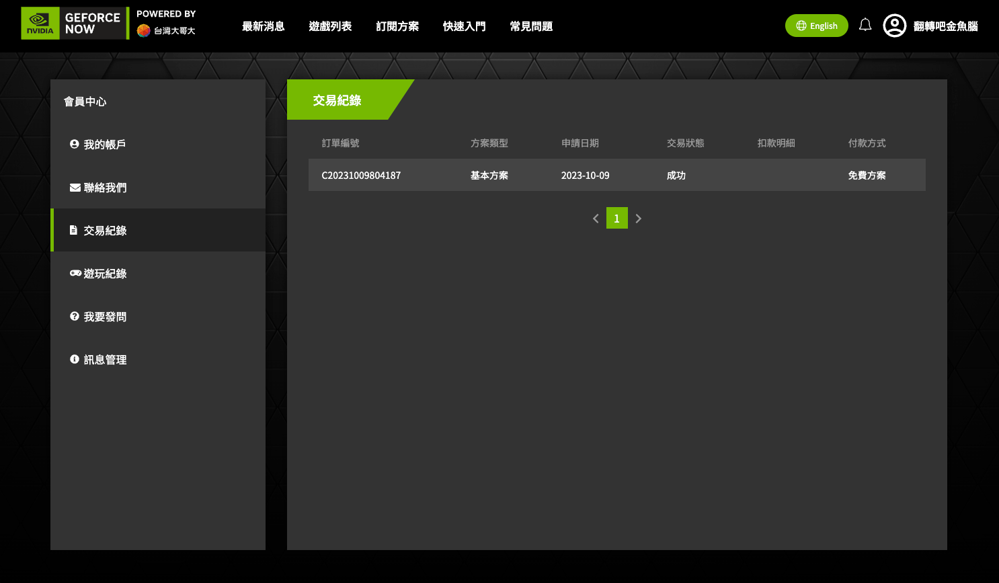
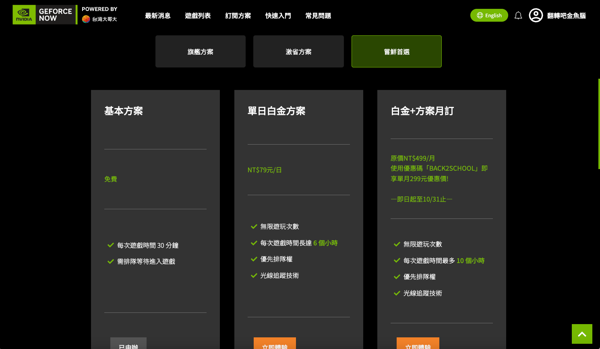
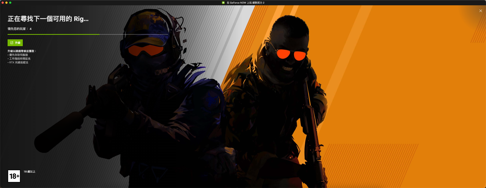

我選擇免費方案，每天能遊玩30分鐘，體驗一下

使用我的MACBOOK M1 PRO登入Counter-Strike 2中，需要排隊一下

下方就是我的遊玩體驗影片，很久沒玩CS，有點爛，見諒 :)

  <iframe src="https://www.youtube.com/embed/vvJtycIxnLM" style="position: absolute; top: 0; left: 0; width: 100%; height: 100%; border:0;" allowfullscreen title="YouTube Video"></iframe>

